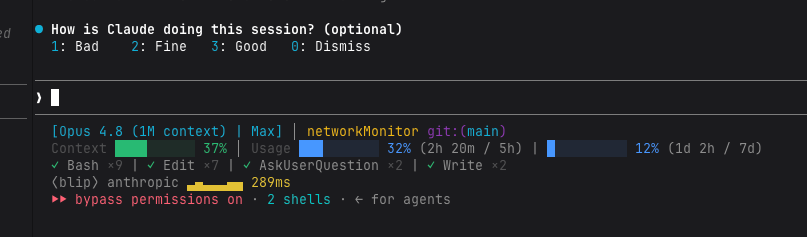

# blip

[中文](README.md) · **English**

[](#claude-code-status-line-hud)
[](https://github.com/rockcode/blip/releases/latest/download/blip.pyz)
[](https://github.com/rockcode/blip/releases/latest)
[](LICENSE)

A network-latency "oscilloscope" for your terminal — watch the connection latency from your machine to multiple LLM APIs render as live Braille waveforms (TLS handshake by default; TCP connect / HTTP first-byte optional), with real-time up/down throughput in each header (macOS). **It also ships a Claude Code plugin** — living in the status line as a one-line HUD ([see below](#claude-code-status-line-hud)). Pure Python standard library, zero dependencies.


*Four APIs side by side: color-coded latency waveforms (a green / yellow / red four-tier scale), packet loss, and live up/down throughput in each header (anthropic is uploading at ↑390K/s here).*

## Why

The most maddening thing about using AI isn't that it's slow — it's **not being able to tell where it's stuck**. A reply hangs and you genuinely can't tell: is the model still busy generating with the network fine, or did the connection die ages ago and you're waiting for nothing? Is it thinking, or is the net down? Keep waiting, or just retry? That blind "I can't tell whether the AI is still working or the network has frozen" feeling is the original reason this exists.

So: blip paints the latency from your machine to each LLM API as a scrolling Braille "oscilloscope" that lives in a corner of your terminal. Is the network up? Are responses steady? Any packet loss? One glance tells you — at least you can rule out (or pin down) "is it the network?" instead of sitting there guessing.

## In use

blip takes up almost no space — park it in a corner or along the bottom of your terminal, and while you work with AI a quick glance tells you whether the model is thinking or the network has frozen.


## Download & run

Grab the **single file** `blip.pyz` from [Releases](https://github.com/rockcode/blip/releases) and run it as-is — it bundles the whole tool into one file with zero third-party dependencies:

    chmod +x blip.pyz          # make it executable (first time only)
    ./blip.pyz                 # run it; watches all targets
    ./blip.pyz anthropic       # watch a single target
    python3 blip.pyz           # or invoke the interpreter explicitly

Needs Python 3.11+ on the machine (any system with Python — macOS / Linux / …). Usage is identical to "Run from source" below.

## Run from source

    python3 blip.py            # default / existing config (all targets)
    python3 blip.py -c my.toml # use a specific config file
    python3 blip.py anthropic  # watch only the target named "anthropic" (or -anthropic)

The first run writes a default config to `~/.config/blip/config.toml` (with Anthropic / OpenAI / Google / DeepSeek).

Requires Python 3.11+ (uses the stdlib `tomllib`); no third-party dependencies.

## Keys

- `q` or `Ctrl-C` — quit
- `p` — pause / resume

## Configuration

Lookup order: `-c <path>` → `./config.toml` → `~/.config/blip/config.toml`.

    interval  = 1.0         # sampling interval (seconds)
    timeout   = 2.0         # connection timeout (seconds)
    mode      = "tls"       # measurement: tcp / tls / http
    scale_max = 800         # fixed Y-axis max (ms), shared by all panels for comparison

    [thresholds]
    bright = 100            # below this: bright green (excellent)
    green  = 200            # below this: green
    yellow = 400            # below this: yellow, at/above: red

    [[targets]]
    name = "anthropic"
    host = "api.anthropic.com"
    port = 443

Colors (four tiers, brighter = faster): `<bright` bright green, `<green` green, `<yellow` yellow, `>=yellow` red; a timeout/failure shows a full-height red spike and counts toward loss.

## Measurement (mode)

| mode | what it measures | when to use |
|------|------|------|
| `tcp` | TCP connect time | LAN / no proxy. **Note: a TUN-mode VPN answers the handshake locally, making this value drastically too low** |
| `tls` | TCP+TLS handshake time (default) | real network RTT; no API key, no real requests, undistorted under a TUN proxy |
| `http` | HTTPS time-to-first-byte (a HEAD request) | closest to real-world experience (includes server processing), slightly heavier |

## How it works

For each `host:443` it measures latency asynchronously (TLS handshake by default, see the table) — no API key, no billable calls, unaffected by ICMP blocking. Samples go into a ring buffer, and each target is drawn on its own Braille canvas as a waveform scrolling to the left.

## Claude Code status-line HUD

Squeeze blip into a single-line, single-target mini-waveform in the Claude Code
status line — a glance tells you whether the model is thinking or the network is
stuck:

    ⟨blip⟩ anthropic ▁▂▃▅▇▆▅ 48ms



*In practice: the bottom `⟨blip⟩ anthropic … 289ms` (yellow) line is blip, stacked beneath your existing status line (coexisting with claude-hud here).*

How it works: `blip --daemon` samples once a second in the background and writes
`~/.cache/blip/state.json`; `blip --statusline` (invoked by the status line)
reads and renders one line in milliseconds and auto-spawns the daemon if needed.
The daemon self-exits once Claude Code is closed.

### Install from the plugin marketplace (recommended)

Run these four slash commands in Claude Code, in order:

```text
/plugin marketplace add rockcode/blip   # 1. add the marketplace
/plugin install blip-hud@blip           # 2. install the plugin
/reload-plugins                         # 3. reload to apply
/blip-hud                               # 4. wire up the status line (writes settings.json)
```

The plugin **bundles `blip.pyz`**, so it works on install — no repo clone, no
hand-typed paths (the machine just needs Python 3.11+). Step 4's `/blip-hud`
writes the `statusLine` into your `~/.claude/settings.json`; if you already have a
status line (e.g. another HUD plugin) it asks whether to replace or stack. Reopen
or refresh Claude Code and you'll see `⟨blip⟩ <target> …`.

### Manual setup

Prefer not to use the plugin? Add this to `~/.claude/settings.json` (swap in your path):

```json
"statusLine": {
  "type": "command",
  "command": "python3 \"/path/to/blip.py\" --statusline anthropic",
  "refreshInterval": 2
}
```

Change the trailing `anthropic` to any target. **Don't omit `refreshInterval`** —
without it the status line only refreshes on events (a reply, a mode switch, …)
and the mini-waveform won't advance on its own; `2` = every 2s (pairs with the 1s
sampling), use `1` for a snappier tick. (Claude Code plugins can't register a
status line directly, so either way this line ends up in the user's
`settings.json`.)

## Traffic (macOS)

When macOS `nettop` is detected, blip **auto-enables** a real-time up/down throughput readout from your machine to each API, appended to the header:

```
anthropic   42ms  avg 48  max 120  loss 0%   ↓1.2M/s ↑45K/s
```

How: under a TUN + fake-IP proxy every domain gets its **own dedicated fake IP**; blip resolves the domain to that fake IP, then uses `nettop` (no sudo) to tally per-connection bytes by remote IP and diffs them into a rate. It refreshes roughly every 5–6s (nettop itself is slow, so it runs in a thread and never blocks the latency waveform).

**Only accurate under fake-IP**: on a bare network / shared real CDN IPs, traffic can't be split per domain; on non-macOS / without `nettop` the feature is hidden.

## Tests

    python3 -m unittest discover -s tests -v

## License

[MIT](LICENSE) © 2026 rockcode
