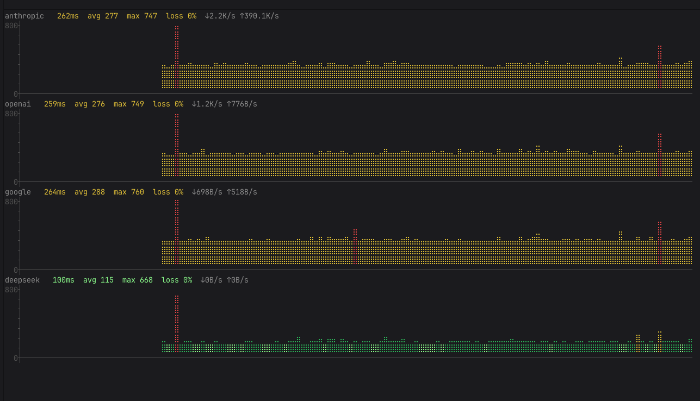
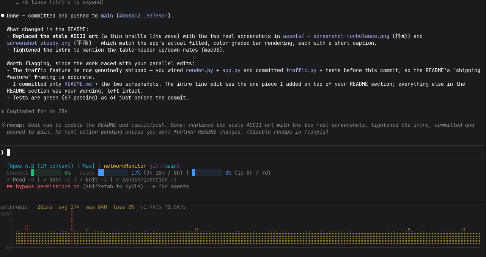
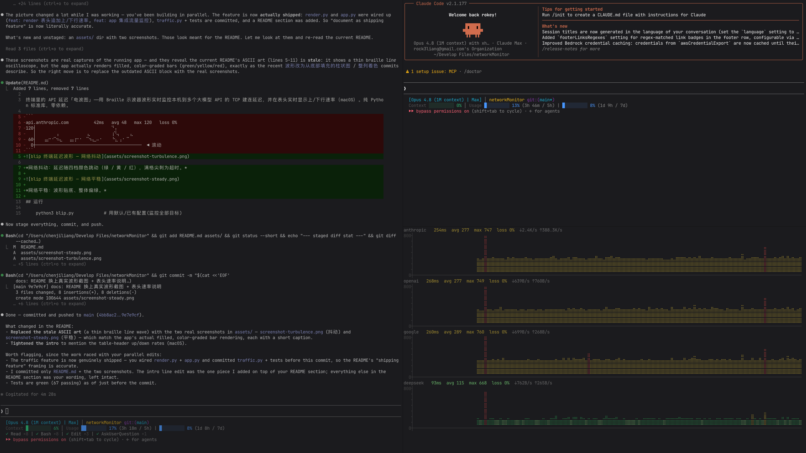

# blip

**中文** · [English](README.en.md)

终端里的 API 延迟「电波图」——用 Braille 示波器波形实时监控本机到多个大模型 API 的连接延迟（默认 TLS 握手，可选 TCP 建连 / HTTP 首字节），并在表头实时显示上/下行速率（macOS）。纯 Python 标准库，零依赖。



*四家 API 并排：彩色延迟波形（绿 / 黄 / 红四档）、丢包率，以及表头实时上/下行速率（图中 anthropic 正 ↑390K/s 上传）。*

## 由来

用 AI 时最难受的，其实不是慢，而是**说不清到底卡在哪**：一个回答迟迟不出来，你根本分不清——是大模型还在埋头生成、网络其实通畅，还是连接早就卡死、白等半天？是它在慢慢想，还是网已经断了？该继续等，还是赶紧重来？这种「无法准确感知 AI 是否还在工作、网络是否通畅，是模型响应慢还是网络卡死」的抓瞎感，才是写这个工具最原始的出发点。

于是有了它：把本机到各家大模型 API 的延迟实时画成滚动的「电波图」常驻在终端角落。网络通不通、响应稳不稳、有没有丢包，扫一眼就有数——至少能先把「是不是网络的锅」这件事看清楚，不用再干等着猜。

## 使用情景

blip 占地很小，常钉在终端的一角或底部——用 AI 时余光一扫，就知道是模型在慢慢想、还是网络已经卡死。





## 下载即用

到 [Releases](https://github.com/rockcode/blip/releases) 下载**单文件** `blip.pyz`，即下即跑——它把整个工具压成一个文件，零第三方依赖：

    chmod +x blip.pyz          # 加可执行位(仅首次)
    ./blip.pyz                 # 直接运行，监控全部目标
    ./blip.pyz anthropic       # 只监控单个目标
    python3 blip.pyz           # 或显式用解释器

需要机器上有 Python 3.11+（macOS / Linux 等任意装了 Python 的系统皆可）；用法与下文「从源码运行」完全一致。

## 从源码运行

    python3 blip.py            # 用默认/已有配置(监控全部目标)
    python3 blip.py -c my.toml # 指定配置文件
    python3 blip.py anthropic  # 只监控名为 anthropic 的单个目标(也可写 -anthropic)

首次运行会在 `~/.config/blip/config.toml` 生成默认配置（含 Anthropic / OpenAI / Google / DeepSeek）。

需要 Python 3.11+（依赖标准库 `tomllib`）；无任何第三方依赖。

## 操作

- `q` 或 `Ctrl-C` 退出
- `p` 暂停 / 继续

## 配置

查找顺序：`-c 指定` → `./config.toml` → `~/.config/blip/config.toml`。

    interval  = 1.0         # 采样间隔(秒)
    timeout   = 2.0         # 建连超时(秒)
    mode      = "tls"       # 测量方式: tcp / tls / http
    scale_max = 800         # 纵轴固定上限(ms)，所有面板统一以便横向对比

    [thresholds]
    bright = 100            # ms 以下: 亮绿(极佳)
    green  = 200            # ms 以下: 绿
    yellow = 400            # ms 以下: 黄, 以上: 红

    [[targets]]
    name = "anthropic"
    host = "api.anthropic.com"
    port = 443

颜色（四档，越快越亮）：`<bright` 亮绿、`<green` 绿、`<yellow` 黄、`>=yellow` 红；超时/失败显示红色满格尖刺并计入 loss。

## 测量方式（mode）

| mode | 含义 | 适用 |
|------|------|------|
| `tcp` | TCP 建连耗时 | 局域网/无代理；**注意：TUN 模式 VPN 会就地应答握手，使该值严重偏低失真** |
| `tls` | TCP+TLS 握手耗时（默认） | 真实网络 RTT，不需 key、不刷请求、TUN 代理下不失真 |
| `http` | HTTPS 首字节耗时（发 HEAD） | 最贴近真实体验（含服务端处理），开销稍高 |

## 工作原理

对每个 `host:443` 异步测量延迟（默认 TLS 握手，见上表），不需要 API key、不产生计费调用、不受 ICMP 屏蔽影响；采样写入环形缓冲，每个目标用一块 Braille 画布画成向左滚动的波形。

## 流量监控（macOS）

检测到 macOS 的 `nettop` 时**自动启用**，表头追加本机到该 API 的实时上/下行速率：

```
anthropic   42ms  avg 48  max 120  loss 0%   ↓1.2M/s ↑45K/s
```

原理：在 TUN + fake-IP 代理下，每个域名分到一个**独占假 IP**；把域名解析成假 IP，再用 `nettop`（免 sudo）按远端 IP 逐连接统计收发字节、差分得速率。流量约每 5~6 秒刷新一次（nettop 自身较慢，在线程里跑、不阻塞延迟波形）。

**仅在 fake-IP 环境下准确**：裸网/真实 CDN 共享 IP 下无法按域名区分流量；非 macOS / 无 nettop 时该功能自动隐藏。

## 测试

    python3 -m unittest discover -s tests -v
